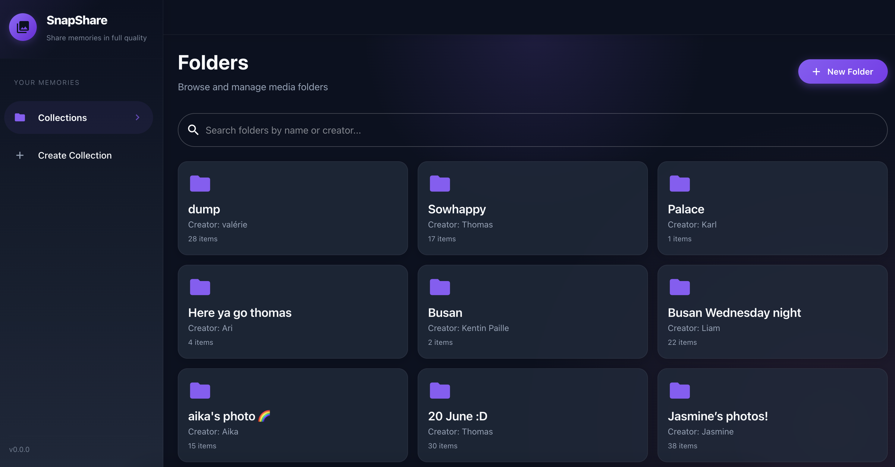

# SnapShare



> SnapShare was created for the exchange students group at Korea University, providing an easy and secure way to share photos and videos from events, trips, and daily life.

SnapShare is a modern, open-source platform for sharing photos and videos in organized folders. It features a secure, privacy-focused backend (NestJS, Prisma, PostgreSQL) and a beautiful, responsive frontend (React, Material UI). SnapShare is ideal for collaborative media sharing, events, or personal collections.

---

## Features

- 📁 **Folder-based organization**: Create folders to group your media, with optional password protection.
- 🔒 **Privacy controls**: Protect folders with passwords; only those with access can view or upload.
- ⬆️ **Fast uploads**: Drag-and-drop or select multiple photos/videos to upload, with progress feedback.
- 🖼️ **Media grid**: Browse, search, and preview photos and videos in a clean, responsive grid.
- 🔗 **Shareable links**: Share folder links with others for easy collaboration.
- 🗑️ **Delete & manage**: Remove folders or media, with confirmation dialogs for safety.
- 🗃️ **Download as ZIP**: Download all media in a folder as a ZIP archive.
- 🏷️ **Metadata**: Media items include uploader, original filename, upload date, and type.
- 🖥️ **Modern UI**: Built with React and Material UI for a seamless user experience.

---

## Architecture

```
[ React Frontend ]  <---->  [ NestJS Backend API ]  <---->  [ PostgreSQL + Prisma ORM ]
```
- **Frontend**: React, TypeScript, Material UI, Socket.io client
- **Backend**: NestJS, TypeScript, Prisma ORM, Socket.io, AWS S3/Google Cloud Storage (for media), PostgreSQL
- **Database**: PostgreSQL (Dockerized for local dev)
- **Deployment**: Docker Compose for full-stack local dev; ready for cloud deployment

---

## Getting Started

### Prerequisites
- Node.js (v18+ recommended)
- Yarn or npm
- Docker & Docker Compose (for full-stack setup)

### 1. Clone the repository
```bash
git clone https://github.com/yourusername/snapshare.git
cd snapshare
```

### 2. Local Development (with Docker)
This will start the database, backend, and frontend in one command.

```bash
docker-compose up --build
```
- Frontend: http://localhost:3081
- Backend API: http://localhost:5001
- PostgreSQL: localhost:5433

### 3. Manual Local Setup (without Docker)
#### Backend
```bash
cd backend
npm install
npx prisma migrate deploy
npm run start:dev
```
- Runs on http://localhost:3000

#### Frontend
```bash
cd frontend
npm install
yarn start # or npm start
```
- Runs on http://localhost:3001

#### Database
- You need a running PostgreSQL instance (see `docker-compose.yml` for env vars)
- Set `DATABASE_URL` in `backend/.env`

---

## Usage

1. **Create a folder**: Enter a name, your name, and (optionally) a password for privacy.
2. **Upload media**: Drag and drop or select files. Progress is shown.
3. **Browse & search**: Use the search bar to filter folders or media by name, uploader, or type.
4. **Download ZIP**: Download all media in a folder as a ZIP archive.
5. **Delete**: Remove folders or media (confirmation required).
6. **Password-protected folders**: Enter the password to access protected folders.

---

## API Overview

### Folder Endpoints
- `GET /api/folders` — List all folders
- `POST /api/folders` — Create a new folder
- `GET /api/folders/:id` — Get folder details
- `DELETE /api/folders/:id` — Delete a folder
- `POST /api/folders/:id/verify` — Verify folder password
- `POST /api/folders/getZip/:id` — Download all media as ZIP

### Media Endpoints
- `GET /api/folders/:folderId/media` — List media in a folder
- `POST /api/folders/:folderId/media/generateSignedUrls` — Get upload URLs for new media
- `POST /api/folders/:folderId/media/uploadComplete` — Confirm upload completion
- `DELETE /api/folders/:folderId/media/:mediaId` — Delete a media item
- `POST /api/media/addThumbnail` — Add a thumbnail to a media item

---

## Data Models (Prisma)

### Folder
```prisma
model Folder {
  id        String   @id @default(uuid())
  name      String
  zipUrl    String   @default("")
  zipHash   String   @default("")
  createdBy String
  password  String?
  createdAt DateTime @default(now())
  deleted   Boolean  @default(false)
  media     Media[]
}
```

### Media
```prisma
model Media {
  id               String    @id @default(uuid())
  folderId         String
  url              String
  thumbnailUrl     String    @default("")
  type             MediaType
  uploadedAt       DateTime  @default(now())
  uploadedBy       String
  originalFilename String?
  deleted          Boolean   @default(false)
  folder           Folder    @relation(fields: [folderId], references: [id], onDelete: Cascade)
}
```

---

## Contributing

Contributions are welcome! Please open issues or pull requests for bug fixes, features, or improvements.

---

## License

This project is licensed under the MIT License.

---

## Credits
- Built with [NestJS](https://nestjs.com/), [React](https://react.dev/), [Material UI](https://mui.com/), and [Prisma](https://www.prisma.io/).
- Created by William Dromard.
